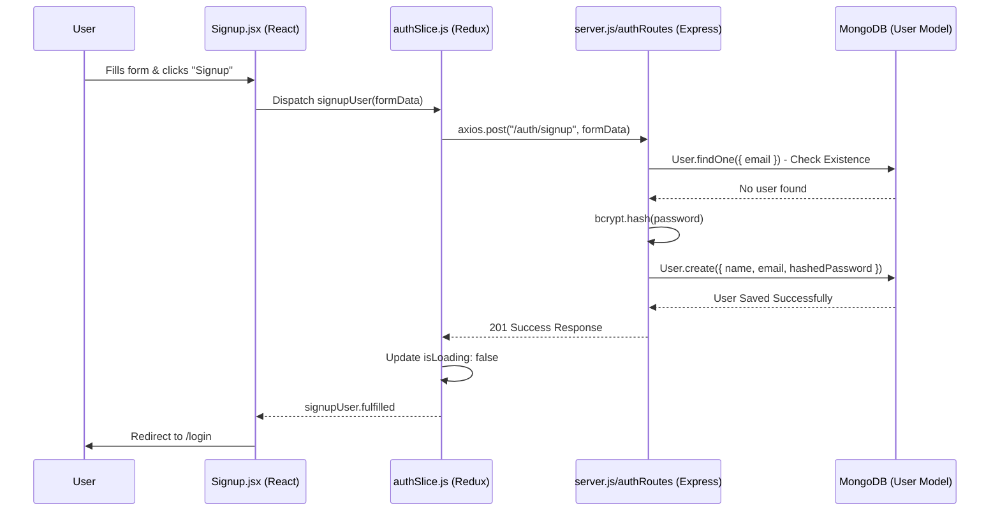
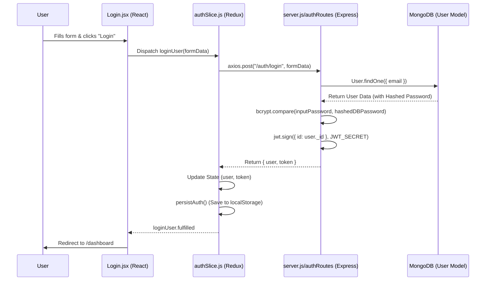
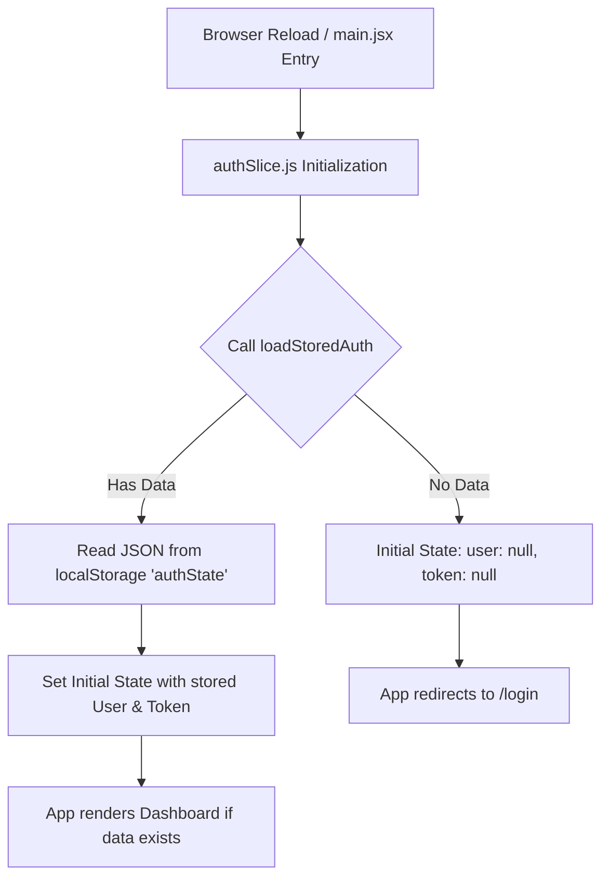

# System Data Flow Documentation

This document explains exactly how data moves through your MERN application during different user actions.

---

## 1. 📝 Signup Data Flow

The process of creating a new account.

---

## 2. 🔑 Login Data Flow

The process of verifying credentials and starting a session.

---

## 3. 🔄 Page Reload & Persistence

How the app remembers you when you close and reopen the tab.

---

## 4. 🗄️ Database Fallback Logic (The "Smart" Connection)

How the backend manages connection failures automatically.

1.  **Stage 1 (Primary)**: The server tries to connect to `process.env.MONGO_URI` (MongoDB Atlas).
2.  **Timeout Setting**: We give it 8 seconds (`serverSelectionTimeoutMS: 8000`) to find the server.
3.  **Error Catch**: If it fails (e.g., your IP isn't whitelisted), it catches the error.
4.  **Stage 2 (Secondary)**: It prints a warning: "Atlas unavailable. Falling back to local...".
5.  **Local Connection**: It tries to connect to `mongodb://127.0.0.1:27017/toastdb`.
6.  **Success**: If local MongoDB is running, the server starts and works perfectly on your machine.

---

## 📂 Key File Responsibilities (Summary)

| File            | Role             | Responsibility                                            |
| :-------------- | :--------------- | :-------------------------------------------------------- |
| `server.js`     | **Orchestrator** | Starts the server, connects to DB, sets up CORS.          |
| `authRoutes.js` | **Guard**        | Logic for Sign-up checks, Password hashing, JWT signing.  |
| `User.js`       | **blueprint**    | Defines how a User looks in the database.                 |
| `authSlice.js`  | **Brain**        | Manages Auth state (loading, error, user) and calls APIs. |
| `axios.js`      | **Messenger**    | Pre-configured API client to talk to the backend.         |
| `App.jsx`       | **Router**       | Controls which page shows up depending on the URL.        |
